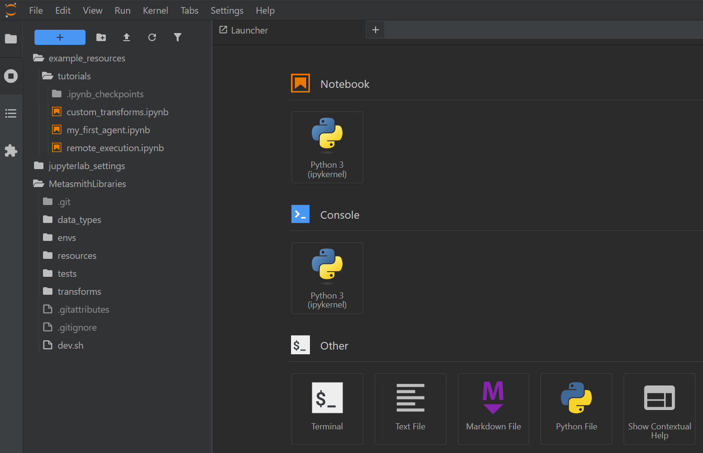
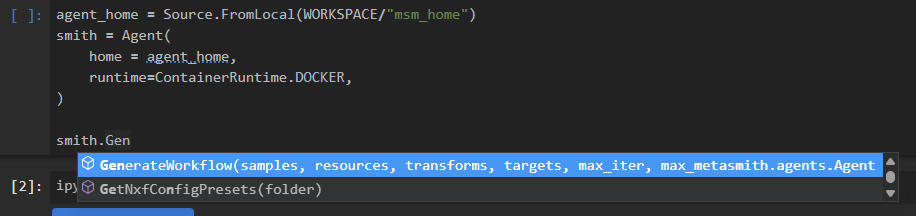
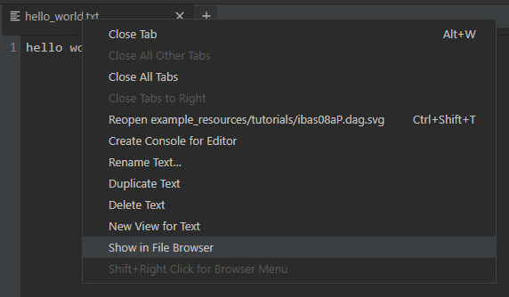

.. role:: python(code)
    :language: python

Tutorials with Jupyter lab
############################################################

Jupyter lab
============================================================

Metasmith comes with a Jupyter lab environment, which provides a visual interface to browse, edit, and execute files.
It is advisable to first create a workspace folder, since additional resources will be downloaded to the
current working directory.

.. code-block:: console
    :caption: Terminal

    $ mkdir -p metasmith_ws
    $ cd metasmith_ws

Once Jupyter lab is started, come back to this page and press the connect button below.

.. code-block:: console
    :caption: Terminal

    $ msm lab --tutorial my_first_agent

.. button-link:: http://127.0.0.1:8080
    :color: primary
    
    **Connect to Jupyter Lab**

The notebook should have been opened automatically, but it can also be found manually 
using the file browser on the left of Jupyter's GUI.

   Jupyter lab GUI with file browser on the left

Resources
============================================================

:python:`msm lab` will setup the current directory with everything needed for any tutorial.
If you want more control over this process, the following will achieve the same result.

Each tutorial comes with a Jupyter notebook which can be copied to the current
directory like so:

.. code-block:: bash
    :caption: Terminal

    $ msm get tutorials/my_first_agent.ipynb

A git repo provides a standard library of Bioinformatics tools that have been integrated into Metasmith,
including those used by the tutorials.

.. code-block:: bash
    :caption: Terminal

    $ git clone https://github.com/hallamlab/MetasmithLibraries.git

Jupyter notebooks
============================================================

The first cell of the Jupyter notebook loads the required elements from the Metasmith API for the tutorial.

.. code-block:: python
    :caption: Jupyter
    :linenos:

    from pathlib import Path
    from metasmith.python_api import Agent, Runtime
    from metasmith.python_api import DataTypeLibrary, DataInstanceLibrary, TransformInstanceLibrary
    from metasmith.python_api import Source, Logistics
    from metasmith.python_api import TargetBuilder, Resources, Size, Duration
    from metasmith.python_api import ipynbButtonLink

We create some variables to reduce ambiguity for important paths. 
If using the packaged Jupyter lab environment, the workspace is 2 folders up since we are in :python:`example_resources/tutorials`.

.. code-block:: python
    :caption: Jupyter
    :linenos:

    WORKSPACE = Path("../../").resolve()
    WORKSPACE

Otherwise, we can just specify the current working directory.

.. code-block:: python
    :caption: Jupyter
    :linenos:

    # or
    WORKSPACE = Path("./")
    WORKSPACE

We also specify the path to the cloned standard library.

.. code-block:: python
    :caption: Jupyter
    :linenos:

    MLIB = WORKSPACE/"MetasmithLibraries"

Autocomplete
------------------------------------------------------------

Autocomplete is configured within Jupyter lab with the :python:`TAB` key.

.. code-block:: python
    :caption: example
    :linenos:

    agent_home = Source.FromLocal(WORKSPACE/"msm_home")
    smith = Agent(
        home = agent_home,
        runtime=Runtime.DOCKER,
    )

    smith.Gen

Finding files
------------------------------------------------------------

A convience tool is provided to display buttons that link to files at a given path.

.. code-block:: python
    :caption: Jupyter
    :linenos:

    # create a new file
    hello_world_file = WORKSPACE/"hello_world.txt"
    with open(hello_world_file, "w") as f:
        f.write("hello world!")

    # show button
    ipynbButtonLink(url=hello_world_file, text="go to hello world")

With the file open, we can right click, then select "Show in File Browser" to find file in the
file browser panel on the left.

   The context menu with "show in file browser"

.. note::

    `Official documentation for Jupyter can be found here <https://docs.jupyter.org/en/latest/>`_

Next Steps
============================================================

.. button-link:: ../tutorials/my_first_agent.html
    :color: primary

    **My first agent**
